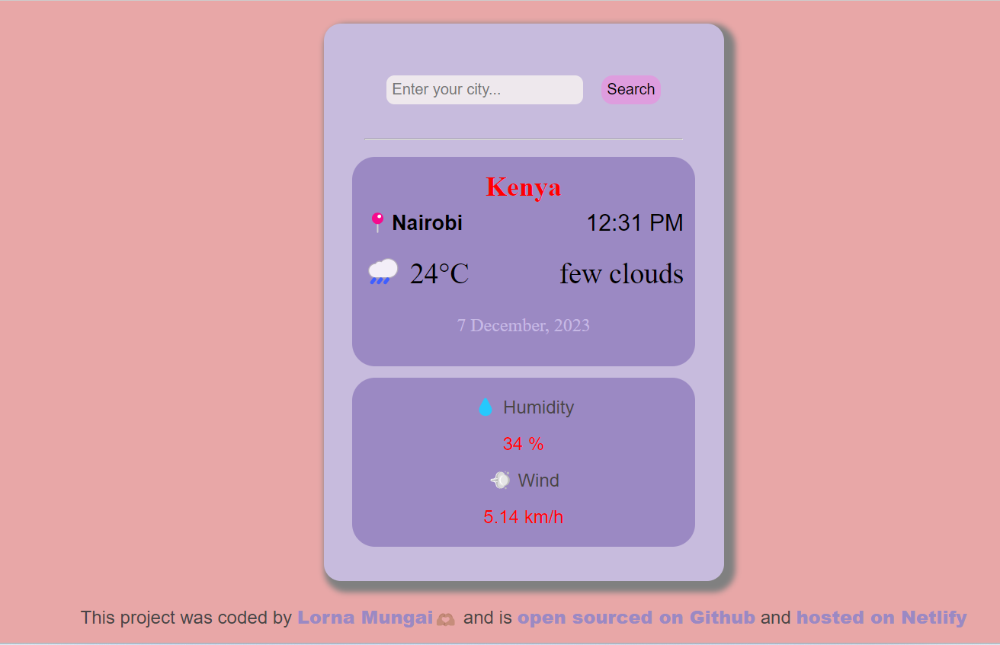

# Hali ya Anga Weather Web Application
- This weather application displays various weather information from various cities around the world.
- This help users know about the weather and data is displayed in a user interactive manner.

Design inspiration is from [Priyadharshini](https://dribbble.com/shots/23174052-Mobile-Weather-App-UI-Design)

The API utilised is from shecodes made by Matt.

This weather application displays the:
- The country name.
- The city name.
- Current timestamp.
- Image to represent overall weather.
- Temperature.
- Description of condition of the weather.
- Current date, month and year.

- Current humidity in the city.
- Wind speed in the city.

[Click Here to visit the Weather Web Application](https://hali-ya-anga-app.netlify.app/)

## Snippet of the Weather Web Application

## Author
You can find me on :
### [Twitter](https://twitter.com/Lornzyy)
### [Github](https://github.com/Lornzyy)

## Learn More
This project was created using HTML CSS and Vanilla Javascript.

This is a project homework from sheCodesPlus Program [sheCodesPlus](https://www.shecodes.io/learn/cohorts/1514/units/30/challenges/188)